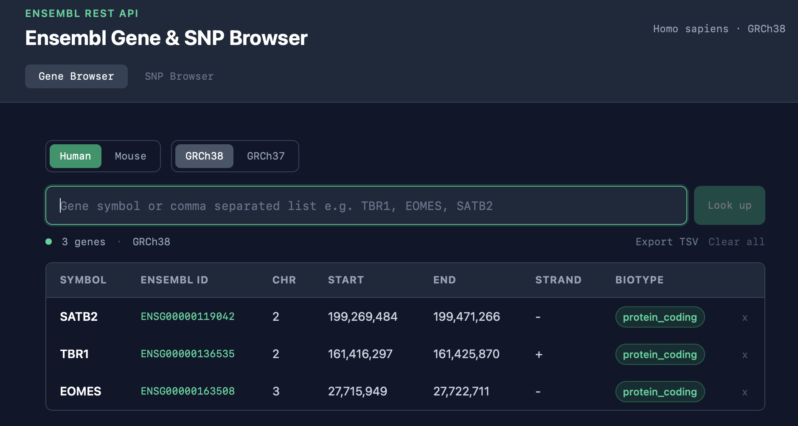

# Ensembl Gene & SNP Browser

An interactive, client-side bioinformatics data browser built with React and Tailwind CSS. Query gene and variant information in real time from the [Ensembl REST API](https://rest.ensembl.org).

**Live app:** https://dazcam.github.io/snp-browser-react/



---

## Features

### Gene Browser
- Search single or multiple gene symbols (e.g. `TBR1`, `EOMES`, `SATB2`)
- Batch input — paste a comma or newline separated list
- Switch between species: *Homo sapiens* and *Mus musculus*
- Switch genome build: GRCh38 / GRCh37 (human only)
- Clickable Ensembl IDs linking to the Ensembl genome browser
- Gene size calculated and displayed in the status bar
- Export results as TSV

### SNP Browser
- Look up single or multiple rsIDs (e.g. `rs429358`, `rs7412`)
- Batch lookup via a single POST request to the Ensembl API
- Displays alleles, ancestral allele, minor allele, MAF, and genomic location
- Location type colour coded — exonic, intronic, UTR, upstream/downstream
- Clickable rsIDs linking to the Ensembl variant page
- Export results as TSV

---

## Tech stack

| Tool | Purpose |
|------|---------|
| React 18 | Component architecture, state management |
| Tailwind CSS 3 | Utility-first styling, dark theme |
| Vite 4 | Build tooling and dev server |
| Ensembl REST API | Gene and variant data |
| GitHub Pages | Static site deployment |

---

## Running locally

Requires Node.js 18+.

```bash
# Clone the repo
git clone https://github.com/Dazcam/snp-browser-react.git
cd snp-browser-react

# Install dependencies
npm install

# Start the dev server
npm run dev
```

Open `http://localhost:5173` in your browser.

---

## Deployment

The app is deployed to GitHub Pages via the `gh-pages` package:

```bash
npm run deploy
```

This builds the app and pushes the `dist/` folder to the `gh-pages` branch.

---

## Project structure

```
src/
├── App.jsx           # Root component — state, routing between browsers
├── SearchBar.jsx     # Gene search input with loading indicator
├── GeneTable.jsx     # Gene results table
├── SNPBrowser.jsx    # SNP browser — search, table, export
├── Controls.jsx      # Species and genome build toggles
├── index.css         # Global styles and Tailwind directives
```

---

## API endpoints used

| Endpoint | Method | Purpose |
|----------|--------|---------|
| `/lookup/symbol/{species}/{symbol}` | GET | Single gene lookup |
| `/lookup/symbol/{species}` | POST | Batch gene lookup |
| `/variation/{species}/{rsid}` | GET | Single SNP lookup |
| `/variation/{species}` | POST | Batch SNP lookup |

---

## Background

Built as a learning project to develop front-end React skills alongside a bioinformatics use case. The app demonstrates component composition, REST API integration, async data fetching, and responsive UI design with Tailwind CSS.

The Ensembl REST API is a public resource — no API key required.

---

## Author

Dazcam — [github.com/Dazcam](https://github.com/Dazcam)
